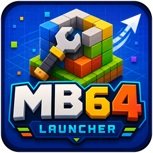
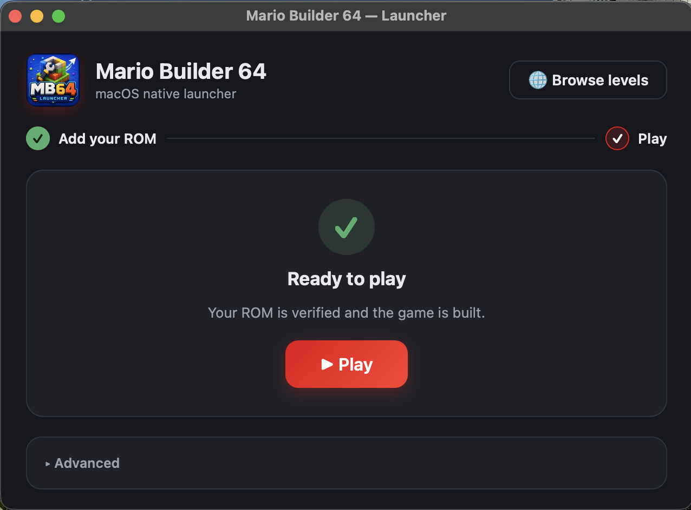

<p align="center">
  
</p>

<h1 align="center">Mario Builder 64 on macOS</h1>

<p align="center">
  Bring your own US Super Mario 64 ROM and play
  <a href="https://github.com/arthurtilly/Mario-Builder-64"><strong>Mario Builder 64</strong></a> —
  arthurtilly's Super Mario 64 hack with a full in-game level editor — as a real,
  double-clickable <strong>native macOS app</strong> on Apple Silicon.
  <strong>No emulator. No ROM patching. No fiddling.</strong>
  Install it, point it at your ROM, and play.
</p>

<p align="center">
  You can also <strong>browse and download community levels</strong> right inside the app,
  straight from <a href="https://levelsharesquare.com">Level Share Square</a> — the
  community hub where Mario Builder 64 creators share their levels.
</p>

<p align="center">
  <code>curl -fsSL https://raw.githubusercontent.com/bigmah/local_mb64/main/install.sh | bash</code>
</p>

<p align="center">
  
</p>

## Install (one command)

```sh
curl -fsSL https://raw.githubusercontent.com/bigmah/local_mb64/main/install.sh | bash
```

This downloads the **prebuilt** launcher, installs it into your Applications folder,
and opens it. Nothing is compiled by the installer, and **no ROM or game data is
downloaded** — only our own launcher + build tooling. You add your own ROM in the app.

> **Why a one-liner and not a clickable download?** The app is unsigned (no Apple
> Developer ID — deliberately, this is an unofficial project). macOS Gatekeeper blocks
> unsigned apps you download in a **browser**, but `curl` downloads aren't flagged that
> way, so the installed app just opens — no "unidentified developer" wall, no signing,
> no Apple account involved.

Then, in the app: **Set up** (it checks for Apple's Command Line Tools + Homebrew,
offering to install anything missing, then clones this open-source project) → **Add
your ROM** (your own US SM64 `.z64`) → it builds itself → **Play**. The first build
compiles a MIPS toolchain and can take a while. From there you can **Browse levels** to
pull community creations from [Level Share Square](https://levelsharesquare.com)
straight into the game.

## Layout

| Path | What |
|------|------|
| `vendor/Mario-Builder-64/` | MB64 decomp source (git submodule, upstream) |
| `app/` | the native macOS app — our glue (`src/mb64_*`), recomp config, CMake |
| `app/lib/` | third-party runtime/renderer/UI libraries (**git submodules**, upstream) |
| `recomp/` | N64Recomp config for MB64 (TOML, symbols, overlays) |
| `launcher/` | Rust + Dioxus launcher app |
| `tools/` | Rust build-orchestration tooling |
| `patches/` | local patches applied to dependencies at build time |
| `docs/` | Architecture and legal notes |

## Building from source

```bash
# 1. Clone WITH submodules (the game, runtime, renderer, and UI libraries)
git clone --recurse-submodules https://github.com/bigmah/local_mb64.git
cd local_mb64
#    (already cloned without --recurse-submodules? run:)
git submodule update --init --recursive

# 2. Check the environment (compilers, cmake/ninja/sdl2, MIPS toolchain, ROM)
cargo run -p mb64-build -- doctor

# 3. One-time: install the MIPS cross toolchain (binutils + gcc, built from source
#    into ~/.mb64/toolchain, ~30–40 min) plus the Homebrew build deps. Skips
#    anything already present.
cargo run -p mb64-build -- install-toolchain

# 4. Provide your own US SM64 ROM as baserom.us.z64 at the repo root, then build:
cargo run -p mb64-build -- all     # build-rom → recompile → build-app
cargo run -p mb64-build -- play    # …or just use the Dioxus launcher:
cargo run -p mb64-launcher         # drop in your SM64 ROM → it builds itself → Play
```

Nothing third-party is committed into this repo: `app/lib/*` are pinned git
submodules, and local changes to dependencies / generated code are kept as
reviewable patches under `patches/`, applied automatically by the `mb64-build`
orchestrator at the right pipeline stage (the `N64ModernRuntime` scheduler-preemption
fix before the app build; the decomp IPA-clone CFLAGS fix before `make`). The MIPS
cross toolchain is built from source on demand — never committed — into a persistent
per-user location the orchestrator and launcher auto-detect.

## How it works

This project turns a pure **N64-target** decompilation into a native Mac app using
**static recompilation** ([N64: Recompiled](https://github.com/N64Recomp/N64Recomp)) —
the same technology behind the standalone *Majora's Mask Recompiled* app — paired with
the RT64 renderer and a Rust + Dioxus launcher. For the full pipeline and where the
Rust code fits, see [docs/ARCHITECTURE.md](docs/ARCHITECTURE.md).

## Docs

- [docs/ARCHITECTURE.md](docs/ARCHITECTURE.md) — the recompilation pipeline and where Rust fits
- [docs/LEGAL.md](docs/LEGAL.md) — ROM/asset/licensing posture

## Credits & acknowledgements

This project is a small layer of original glue (the `app/src/mb64_*` native code,
the Rust launcher, and the build tooling) on top of a large body of existing
open-source work. Nearly everything that makes a native build possible was written
by other people — huge thanks to all of them.

**The game**

- [**Mario Builder 64**](https://github.com/arthurtilly/Mario-Builder-64) — by
  *arthurtilly* and contributors. The SM64 ROM hack / in-game level editor this
  project plays. Vendored as a git submodule (`vendor/Mario-Builder-64`).
- [**HackerSM64**](https://github.com/HackerN64/HackerSM64) — the modernized SM64
  decompilation base that Mario Builder 64 is built on.

**Community levels**

- [**Level Share Square**](https://levelsharesquare.com) — the community site where
  Mario Builder 64 creators publish and share their levels. The in-app **Browse levels**
  feature reads from LSS's public API so you can download community levels straight into
  the game. All level content belongs to its respective creators; please support them
  on the site.

**The recompilation + runtime stack** (the *Majora's Mask Recompiled* technology
that lets an N64 ROM run as a native program)

- [**N64: Recompiled**](https://github.com/N64Recomp/N64Recomp) (`N64Recomp` /
  `RSPRecomp`) — by *Wiseguy* and the N64Recomp project. Statically recompiles the
  game's MIPS code (and audio microcode) into C.
- [**RT64**](https://github.com/rt64/rt64) — by *Dario Sanfilippo (DarioSamo)* et al.
  The high-accuracy N64 renderer (native Metal on macOS). *MIT.*
- [**N64ModernRuntime**](https://github.com/N64Recomp/N64ModernRuntime)
  (`librecomp` + `ultramodern`) — the libultra reimplementation and recomp runtime.
  *GPLv3.* In turn builds on [xxHash](https://github.com/Cyan4973/xxHash),
  [miniz](https://github.com/richgel999/miniz), and
  [o1heap](https://github.com/N64Recomp/o1heap).
- [**drmario64_recomp**](https://github.com/AngheloAlf/drmario64_recomp) — by
  *AngheloAlf*. The recomp app template our `app/` scaffold is adapted from.
- [**Zelda64Recomp**](https://github.com/Zelda64Recomp/Zelda64Recomp) — the
  reference recomp application that template descends from.

**Bundled libraries** (vendored as submodules under `app/lib/`)

- [**RmlUi**](https://github.com/mikke89/RmlUi) — *mikke89* — HTML/CSS UI library. *MIT.*
- [**moodycamel::ConcurrentQueue**](https://github.com/cameron314/concurrentqueue) — *cameron314*. *zlib.*
- [**lunasvg**](https://github.com/sammycage/lunasvg) — *sammycage* — SVG rendering. *MIT.*
- [**sse2neon**](https://github.com/DLTcollab/sse2neon) — *DLTcollab* — SSE→NEON shim for arm64. *MIT.*
- [**GamepadMotionHelpers**](https://github.com/JibbSmart/GamepadMotionHelpers) — *JibbSmart* — gyro/motion input. *MIT.*
- [**SlotMap**](https://github.com/SergeyMakeev/SlotMap) — *SergeyMakeev*. *MIT.*
- [**FreeType**](https://freetype.org) (via [freetype-windows-binaries](https://github.com/ubawurinna/freetype-windows-binaries)) — font rasterization. *FreeType License.*

**Licensing note.** Because it incorporates N64ModernRuntime and the
Zelda64Recomp/drmario64_recomp app scaffold (both **GPLv3**), this project as a
whole is distributed under the **GPLv3** (see [`app/COPYING`](app/COPYING)). RT64 is
MIT and the bundled UI/utility libraries are MIT/zlib as noted above. This repository
contains **no Nintendo code or assets** — you supply your own ROM at build time. See
[docs/LEGAL.md](docs/LEGAL.md).
